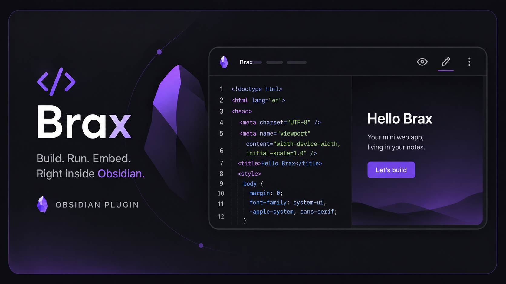

# Brax

[](https://obsidian.md/plugins?id=brax)
[](https://github.com/Im-Hugo/obsidian-brax/releases)
[](https://opensource.org/licenses/MIT)

<p align="center">
  <a href="#-english">English</a> •
  <a href="#-فارسی">فارسی</a> •
  <a href="#-中文">中文</a>
</p>

---

## 🇬🇧 English

### What is Brax?

Brax is an Obsidian plugin that turns your vault into a small playground for building and running tiny web apps, right next to your notes. You write plain HTML, CSS, and JavaScript in a `.brax` file (or inside a fenced ```brax code block in a regular note), and Brax renders it live inside a sandboxed iframe. No build step, no external server, no leaving Obsidian. It's meant for the kind of thing you'd normally open CodePen or a scratch HTML file for: a quick calculator, a habit tracker widget, a little game, a visual experiment, a custom dashboard for your notes — anything that fits in a single HTML document.

The idea behind Brax is simple. Obsidian is already a place where people keep their thinking, their plans, and their tools. A lot of that thinking eventually wants to become something interactive — a checklist that updates itself, a small simulator, a converter, a mini app that only makes sense in the context of one specific note. Instead of switching to a browser, a separate editor, and a separate file system, Brax lets that interactive piece live inside the vault itself, versioned and synced the same way as everything else you write.

### Features

- **Live preview as you type.** Every `.brax` file opens in a custom view with two modes: a preview mode that shows the running app, and an edit mode with a proper code editor (line numbers, tab indentation, monospace font, scrollable). Switching between them is a single click on the toolbar icon, or a keyboard command.
- **Auto-run.** While editing, Brax waits a short moment after you stop typing and then re-renders the app automatically, so you get near-instant feedback without having to manually refresh anything.
- **Manual save.** `Ctrl+S` / `Cmd+S` saves the file like any other note in Obsidian, with a small confirmation notice.
- **Code blocks too.** You don't need a dedicated file for every experiment. Drop a ```brax fenced code block into any normal markdown note, and Brax will render it inline as a small embedded app, with a toggle button to show or hide the raw source underneath it.
- **Touch support inside the sandbox.** The preview iframe forwards touch events properly, so apps you build behave correctly on tablets and touch-enabled devices, not just with mouse input.
- **Sandboxed execution.** Every rendered app runs inside an iframe with a restricted sandbox policy. This keeps your apps isolated from each other and from Obsidian's own internals, so a buggy or experimental script can't reach outside its own little box.
- **Quick creation.** A ribbon icon and a command let you spin up a brand new `.brax` file in seconds, complete with a small starter template (a gradient background, a heading, and a button) so you're never staring at a truly blank file.
- **Command palette integration.** Create a new app, insert a Brax code block into the current note, or toggle edit/preview mode — all available as standard Obsidian commands, so you can bind them to your own hotkeys.

### Installation

**From within Obsidian (recommended):**

1. Open **Settings → Community plugins**.
2. Make sure **Restricted mode** is turned off.
3. Click **Browse**, search for "Brax", and select it.
4. Click **Install**, then **Enable**.

**Manually:**

1. Download the latest release from the [Releases page](https://github.com/Im-Hugo/obsidian-brax/releases).
2. Extract `main.js`, `manifest.json`, and `styles.css` into a new folder named `brax` inside your vault's `.obsidian/plugins/` directory.
3. Reload Obsidian, then enable the plugin from **Settings → Community plugins**.

### Getting Started

1. Click the Brax ribbon icon (a `</>` symbol) in the left sidebar, or run the **"Create new Brax App"** command from the command palette.
2. Give your app a name. A new file with a `.brax` extension will be created and opened automatically.
3. By default, the file opens in preview mode, showing the starter template already running.
4. Click the pencil icon in the top right to switch to edit mode, and start changing the HTML, CSS, or JavaScript.
5. As you type, the preview updates automatically a moment after you pause. Click the eye icon to jump back to the full preview at any time.
6. Save with `Ctrl+S` / `Cmd+S`, just like any other file.

If you'd rather embed something small directly inside a note instead of creating a separate file, place your cursor where you want it and run the **"Insert Brax code block"** command. This inserts a ready-to-edit ```brax block with a small starter snippet, which will render live wherever that note is previewed.

### Settings

Brax currently exposes one setting:

- **Sandbox iframes** — keeps apps isolated from Obsidian's internals. This is enabled by default and it is strongly recommended to leave it on, since it's the main safeguard between the code you (or someone else) writes inside a `.brax` file and the rest of your Obsidian environment.

### A note on safety

Because Brax executes whatever HTML, CSS, and JavaScript you put into a file, you should treat `.brax` files the same way you'd treat any other piece of executable code: don't open or run files from sources you don't trust. Sandboxing reduces the blast radius significantly, but it isn't an absolute guarantee, especially since the preview iframe is granted script execution alongside same-origin and form/popup permissions in order to support fully functional little apps. If you're sharing a vault with others, treat `.brax` files with the same caution you'd give to any script someone else wrote.

### Use cases

People have used the underlying idea behind Brax-style plugins for things like: quick unit converters tucked into a reference note, small flashcard or quiz widgets for study vaults, simple habit or mood trackers with buttons and counters, tiny canvas-based sketches or generative art experiments, embedded calculators for project-specific formulas, and one-off interactive diagrams that are easier to build with a few lines of JavaScript than to draw by hand.

### Contributing

Issues, feature requests, and pull requests are welcome on the [GitHub repository](https://github.com/Im-Hugo/obsidian-brax). If you run into a bug, please include your Obsidian version, your operating system, and — if possible — a minimal `.brax` file that reproduces the problem.

### License

This project is released under the [MIT License](https://opensource.org/licenses/MIT). You're free to use, modify, and redistribute it, including for commercial purposes, as long as the original license and copyright notice are preserved.

---

## 🇮🇷 فارسی

### براکس چیست؟

براکس یک پلاگین برای آبسیدیان است که به واقع گنجه‌ی شما را به یک محیط کوچک برای ساختن و اجرای اپلیکیشن‌های وب کوچک تبدیل می‌کند، دقیقاً کنار یادداشت‌های خودتان. شما کد HTML، CSS و JavaScript خام را در یک فایل با پسوند `.brax` می‌نویسید (یا داخل یک بلوک کد با علامت ```brax در یک یادداشت معمولی)، و براکس آن را به‌صورت زنده و در یک iframe ایزوله‌شده اجرا می‌کند. بدون نیاز به مرحله بیلد، بدون سرور خارجی، و بدون نیاز به خروج از آبسیدیان. این پلاگین برای همان نوع کارهایی طراحی شده که معمولاً برایشان CodePen یا یک فایل HTML موقت باز می‌کردید: یک ماشین‌حساب سریع، یک ابزار ردیابی عادت، یک بازی کوچک، یک تجربه‌ی تصویری، یا یک داشبورد سفارشی برای یادداشت‌هایتان — هر چیزی که در یک سند HTML واحد جا بشود.

ایده‌ی پشت براکس ساده است. آبسیدیان از قبل جایی است که افراد افکار، برنامه‌ها و ابزارهایشان را در آن نگه می‌دارند. بخش زیادی از آن افکار، دیر یا زود، می‌خواهد به چیزی تعاملی تبدیل شود — یک چک‌لیست که خودش به‌روز می‌شود، یک شبیه‌ساز کوچک، یک مبدل واحد، یا یک اپلیکیشن کوچک که فقط در بافت یک یادداشت خاص معنا دارد. به‌جای رفتن به یک مرورگر، یک ویرایشگر جدا، و یک سیستم فایل جدا، براکس اجازه می‌دهد که آن بخش تعاملی همان‌جا داخل گنجه زندگی کند، با همان قواعد نسخه‌بندی و همگام‌سازی که بقیه نوشته‌هایتان دارند.

### امکانات

- **پیش‌نمایش زنده هنگام تایپ.** هر فایل `.brax` در یک نمای سفارشی با دو حالت باز می‌شود: حالت پیش‌نمایش که اپلیکیشن در حال اجرا را نشان می‌دهد، و حالت ویرایش با یک ویرایشگر کد واقعی (شماره‌ی خطوط، تورفتگی با تب، فونت تک‌فاصله، و قابلیت اسکرول). جابه‌جایی بین این دو حالت تنها با یک کلیک روی آیکن نوار ابزار یا یک دستور کیبوردی انجام می‌شود.
- **اجرای خودکار.** هنگام ویرایش، براکس مدت کوتاهی پس از توقف تایپ صبر می‌کند و سپس اپلیکیشن را به‌طور خودکار دوباره رندر می‌کند، بنابراین تقریباً بازخورد آنی می‌گیرید بدون نیاز به رفرش دستی.
- **ذخیره‌ی دستی.** کلید ترکیبی `Ctrl+S` یا `Cmd+S` فایل را مانند هر یادداشت دیگر در آبسیدیان ذخیره می‌کند، همراه با یک اعلان کوچک تأیید.
- **بلوک‌های کد هم همینطور.** نیازی نیست برای هر آزمایش یک فایل جداگانه بسازید. کافی است یک بلوک کد با علامت ```brax داخل هر یادداشت مارک‌داون معمولی قرار دهید، و براکس آن را به‌صورت یک اپلیکیشن کوچک تعبیه‌شده در همان‌جا رندر می‌کند، همراه با یک دکمه‌ی تغییر وضعیت برای نمایش یا پنهان کردن کد منبع زیر آن.
- **پشتیبانی از لمس داخل محیط ایزوله.** آی‌فریم پیش‌نمایش رویدادهای لمسی را به‌درستی منتقل می‌کند، بنابراین اپلیکیشن‌هایی که می‌سازید روی تبلت‌ها و دستگاه‌های لمسی هم درست رفتار می‌کنند، نه فقط با موس.
- **اجرای ایزوله و امن.** هر اپلیکیشن رندرشده داخل یک آی‌فریم با سیاست sandbox محدود اجرا می‌شود. این کار باعث می‌شود اپلیکیشن‌ها از یکدیگر و از هسته‌ی داخلی آبسیدیان جدا بمانند، بنابراین یک اسکریپت معیوب یا آزمایشی نمی‌تواند از محدوده‌ی کوچک خودش خارج شود.
- **ایجاد سریع.** یک آیکن در نوار کناری و یک دستور به شما اجازه می‌دهد در عرض چند ثانیه یک فایل `.brax` جدید بسازید، همراه با یک قالب آغازین کوچک (یک پس‌زمینه‌ی گرادیانی، یک عنوان، و یک دکمه) تا هیچ‌وقت با یک فایل کاملاً خالی مواجه نشوید.
- **یکپارچگی با پالت دستورات.** ساخت اپلیکیشن جدید، درج بلوک کد براکس در یادداشت فعلی، یا تغییر بین حالت ویرایش و پیش‌نمایش — همگی به‌صورت دستورات استاندارد آبسیدیان در دسترس هستند، بنابراین می‌توانید برایشان کلید میانبر دلخواه تعریف کنید.

### نصب

**از داخل خود آبسیدیان (روش پیشنهادی):**

۱. به مسیر **Settings → Community plugins** بروید.
۲. مطمئن شوید گزینه‌ی **Restricted mode** خاموش است.
۳. روی **Browse** کلیک کنید، عبارت «Brax» را جستجو کنید و آن را انتخاب کنید.
۴. روی **Install** و سپس **Enable** کلیک کنید.

**نصب دستی:**

۱. آخرین نسخه را از صفحه‌ی [Releases](https://github.com/Im-Hugo/obsidian-brax/releases) دانلود کنید.
۲. فایل‌های `main.js`، `manifest.json` و `styles.css` را در یک پوشه‌ی جدید به نام `brax` داخل مسیر `.obsidian/plugins/` گنجه‌ی خودتان قرار دهید.
۳. آبسیدیان را دوباره بار کنید و سپس پلاگین را از مسیر **Settings → Community plugins** فعال کنید.

### شروع کار

۱. روی آیکن براکس (نمادی شبیه `</>`) در نوار کناری سمت چپ کلیک کنید، یا دستور **«Create new Brax App»** را از پالت دستورات اجرا کنید.
۲. برای اپلیکیشن خود یک نام انتخاب کنید. یک فایل جدید با پسوند `.brax` ساخته و به‌طور خودکار باز می‌شود.
۳. به‌طور پیش‌فرض، فایل در حالت پیش‌نمایش باز می‌شود و قالب آغازین را در حال اجرا نشان می‌دهد.
۴. روی آیکن مداد در گوشه‌ی بالا سمت راست کلیک کنید تا به حالت ویرایش بروید، و شروع کنید به تغییر کد HTML، CSS یا JavaScript.
۵. همان‌طور که تایپ می‌کنید، پیش‌نمایش با کمی تأخیر پس از توقف تایپ به‌طور خودکار به‌روز می‌شود. هر زمان خواستید، با کلیک روی آیکن چشم می‌توانید به پیش‌نمایش کامل برگردید.
۶. با `Ctrl+S` یا `Cmd+S` ذخیره کنید، دقیقاً مثل هر فایل دیگر.

اگر ترجیح می‌دهید چیز کوچکی را مستقیماً داخل یک یادداشت جا بدهید به‌جای ساختن یک فایل جدا، مکان‌نما را جایی که می‌خواهید قرار دهید و دستور **«Insert Brax code block»** را اجرا کنید. این کار یک بلوک ```brax آماده‌ی ویرایش با یک قطعه‌کد آغازین کوچک درج می‌کند، که هر جا آن یادداشت پیش‌نمایش شود، به‌صورت زنده رندر می‌شود.

### تنظیمات

براکس در حال حاضر یک تنظیم دارد:

- **Sandbox iframes** — اپلیکیشن‌ها را از هسته‌ی داخلی آبسیدیان ایزوله نگه می‌دارد. این گزینه به‌طور پیش‌فرض فعال است و قویاً توصیه می‌شود روشن بماند، چون اصلی‌ترین خط دفاعی بین کدی که شما (یا شخص دیگری) داخل یک فایل `.brax` می‌نویسید و بقیه‌ی محیط آبسیدیان شماست.

### نکته‌ای درباره‌ی امنیت

از آنجا که براکس هر کد HTML، CSS و JavaScript‌ای که داخل یک فایل قرار دهید را اجرا می‌کند، باید با فایل‌های `.brax` همان‌طور رفتار کنید که با هر تکه کد اجرایی دیگر رفتار می‌کنید: فایل‌هایی را که از منابع نامعتبر می‌آیند باز یا اجرا نکنید. ایزوله‌سازی (sandbox) به‌طور قابل‌توجهی شعاع آسیب احتمالی را کم می‌کند، اما تضمین مطلق نیست، به‌خصوص از آنجا که آی‌فریم پیش‌نمایش برای پشتیبانی از اپلیکیشن‌های کاملاً کاربردی، اجازه‌ی اجرای اسکریپت را همراه با مجوزهای same-origin و فرم/پاپ‌آپ دریافت می‌کند. اگر گنجه‌ای را با دیگران به اشتراک می‌گذارید، با فایل‌های `.brax` همان احتیاطی را داشته باشید که با هر اسکریپت نوشته‌شده توسط شخص دیگر دارید.

### کاربردها

افراد از این ایده برای کارهایی مانند این استفاده کرده‌اند: مبدل‌های واحد سریع که داخل یک یادداشت مرجع جا داده شده‌اند، ابزارک‌های کوچک فلش‌کارت یا کوییز برای گنجه‌های درسی، ردیاب‌های ساده‌ی عادت یا حالت روحی با دکمه و شمارنده، طرح‌های کوچک مبتنی بر کانواس یا آزمایش‌های هنر تولیدی، ماشین‌حساب‌های تعبیه‌شده برای فرمول‌های مخصوص یک پروژه، و نمودارهای تعاملی یک‌باره‌ای که ساختن‌شان با چند خط جاوااسکریپت ساده‌تر از کشیدن دستی است.

### مشارکت

گزارش مشکل، پیشنهاد امکانات جدید، و پول‌ریکوئست در [مخزن گیت‌هاب](https://github.com/Im-Hugo/obsidian-brax) پذیرفته می‌شود. اگر با یک باگ مواجه شدید، لطفاً نسخه‌ی آبسیدیان، سیستم‌عامل خود، و در صورت امکان یک فایل `.brax` حداقلی که مشکل را بازتولید می‌کند را همراه گزارش‌تان قرار دهید.

### مجوز

این پروژه تحت [مجوز MIT](https://opensource.org/licenses/MIT) منتشر شده است. شما آزادید آن را استفاده، تغییر و بازتوزیع کنید، حتی برای مقاصد تجاری، تا زمانی که مجوز اصلی و اعلان حق نشر حفظ شود.

---

## 🇨🇳 中文

### Brax 是什么？

Brax 是一款 Obsidian 插件，它把你的笔记库变成了一个小小的网页应用游乐场，就在你的笔记旁边运行。你只需在一个 `.brax` 文件里（或者在普通笔记中的一段 ```brax 代码块里）写下纯粹的 HTML、CSS 和 JavaScript，Brax 就会在一个隔离的 iframe 中实时渲染出来。不需要构建流程，不需要外部服务器，也不需要离开 Obsidian。它适合那些你原本会打开 CodePen 或者随手建一个 HTML 文件来做的事情：一个快速的计算器，一个习惯追踪小工具，一个小游戏，一段视觉实验，或者专门给某篇笔记用的自定义仪表盘——只要能装进一个 HTML 文档里的东西都行。

Brax 背后的想法很简单。Obsidian 本来就是人们存放思考、计划和工具的地方。这些想法中的很多最终都想变成一个可交互的东西——一个会自己更新的清单，一个小型模拟器，一个换算工具，或者一个只在某篇特定笔记的语境下才有意义的小应用。Brax 不需要你切换到浏览器、另一个编辑器、另一个文件系统，而是让这个交互部分直接活在笔记库里面，和你写的其他一切一样被版本管理和同步。

### 功能特点

- **边写边看的实时预览。** 每个 `.brax` 文件都会在一个自定义视图中打开，包含两种模式：展示正在运行的应用的预览模式，以及带有正规代码编辑器的编辑模式（行号、Tab 缩进、等宽字体、可滚动）。两种模式之间只需点击工具栏上的图标，或者使用一个键盘命令即可切换。
- **自动运行。** 在编辑过程中，Brax 会在你停止输入后短暂等待，然后自动重新渲染应用，这样你几乎能立刻看到反馈，而不需要手动刷新任何东西。
- **手动保存。** `Ctrl+S` 或 `Cmd+S` 会像保存 Obsidian 中任何其他笔记一样保存该文件，并附带一个简短的确认提示。
- **代码块同样支持。** 你不需要为每一次实验都新建一个文件。直接在任何普通的 Markdown 笔记里插入一段 ```brax 代码块，Brax 就会把它内嵌渲染成一个小型应用，并配有一个切换按钮，用来显示或隐藏下方的原始源代码。
- **沙箱内的触控支持。** 预览用的 iframe 会正确转发触控事件，所以你做出来的应用在平板和触控设备上也能正常工作，而不只是支持鼠标输入。
- **沙箱化运行。** 每个渲染出来的应用都在一个具有受限沙箱策略的 iframe 中运行。这样可以让各个应用彼此隔离，也和 Obsidian 自身的内部机制隔离开，因此一段有缺陷或带实验性质的脚本不会跑到自己的小盒子之外。
- **快速创建。** 一个侧边栏图标和一个命令，让你在几秒钟内就能创建一个全新的 `.brax` 文件，并自带一个简单的起始模板（渐变背景、一个标题、一个按钮），所以你永远不会面对一个真正空白的文件。
- **命令面板集成。** 创建新应用、在当前笔记中插入 Brax 代码块，或者切换编辑/预览模式——这些都作为标准的 Obsidian 命令提供，因此你可以为它们绑定自己习惯的快捷键。

### 安装方法

**在 Obsidian 内安装（推荐）：**

1. 打开 **设置 → 第三方插件（Community plugins）**。
2. 确保 **受限模式（Restricted mode）** 已关闭。
3. 点击 **浏览（Browse）**，搜索 "Brax"，然后选中它。
4. 点击 **安装（Install）**，再点击 **启用（Enable）**。

**手动安装：**

1. 从 [发布页面](https://github.com/Im-Hugo/obsidian-brax/releases) 下载最新版本。
2. 将 `main.js`、`manifest.json` 和 `styles.css` 解压到你笔记库 `.obsidian/plugins/` 目录下新建的 `brax` 文件夹中。
3. 重新加载 Obsidian，然后在 **设置 → 第三方插件** 中启用该插件。

### 快速上手

1. 点击左侧边栏中的 Brax 图标（一个 `</>` 符号），或者通过命令面板运行 **"Create new Brax App"** 命令。
2. 为你的应用起一个名字。一个带有 `.brax` 扩展名的新文件会被创建并自动打开。
3. 默认情况下，文件会以预览模式打开，并展示正在运行的起始模板。
4. 点击右上角的铅笔图标切换到编辑模式，然后开始修改 HTML、CSS 或 JavaScript 代码。
5. 在你输入的过程中，预览会在你停顿一会儿之后自动更新。随时点击眼睛图标即可跳回完整预览。
6. 用 `Ctrl+S` 或 `Cmd+S` 保存，和保存其他文件完全一样。

如果你想直接把一个小东西嵌入笔记，而不想单独建一个文件，把光标放到想要的位置，运行 **"Insert Brax code block"** 命令即可。这会插入一个可直接编辑的 ```brax 代码块，附带一小段起始代码，无论这篇笔记在哪里被预览，它都会实时渲染出来。

### 设置项

Brax 目前提供一个设置项：

- **沙箱化 iframe（Sandbox iframes）**——让应用与 Obsidian 内部机制保持隔离。该选项默认开启，强烈建议保持开启状态，因为这是你（或他人）写在 `.brax` 文件中的代码，与你 Obsidian 环境其他部分之间的主要防护屏障。

### 关于安全性的说明

由于 Brax 会执行你放入文件中的任何 HTML、CSS 和 JavaScript 代码，你应该像对待任何其他可执行代码一样对待 `.brax` 文件：不要打开或运行来自不信任来源的文件。沙箱化能显著缩小潜在影响范围，但并不是绝对的保证，尤其是因为预览用的 iframe 为了支持功能完整的小应用，被授予了脚本执行权限，并附带同源（same-origin）以及表单、弹窗相关的权限。如果你与他人共享同一个笔记库，对待 `.brax` 文件时，应保持和对待他人编写的任何脚本同样的谨慎态度。

### 应用场景

人们用类似 Brax 这样的思路做过不少事情，比如：嵌在参考笔记里的快速单位换算器，用于学习笔记库的小型抽认卡或测验小工具，带按钮和计数器的简单习惯或心情追踪器，基于画布的小型草图或生成艺术实验，为某个项目专属公式而做的内嵌计算器，以及那些用几行 JavaScript 比手绘更容易实现的一次性交互图表。

### 参与贡献

欢迎在 [GitHub 仓库](https://github.com/Im-Hugo/obsidian-brax) 提交问题反馈、功能建议和拉取请求。如果你遇到了 bug，请附上你的 Obsidian 版本、操作系统，以及（如果可能的话）一个能复现该问题的最小化 `.brax` 文件。

### 许可证

本项目基于 [MIT 许可证](https://opensource.org/licenses/MIT) 发布。只要保留原始许可证和版权声明，你就可以自由地使用、修改和再分发它，包括用于商业目的。
